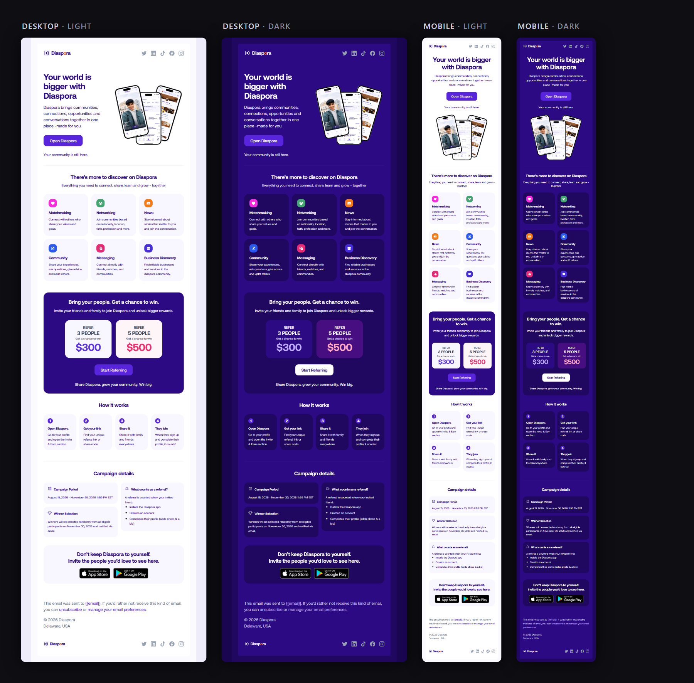

# Email Designs

Production HTML email, designed and built end to end — Figma through to the markup that
ships. Each project lives in its own folder with its renders, its architecture notes, and
an honest account of what has and has not been tested.

By [Adekoya Oluwafemi A.](https://github.com/heykoyr), Product Designer.

---

## Diaspora — Referral Campaign

**Diaspora** is a community app for diaspora communities, shipped on iOS and Android.
This referral campaign asks existing members to invite people they know — refer 3 for a
chance at $300, refer 5 for a chance at $500.

I designed the email in Figma from scratch, then built it as **one** HTML document that
renders as all four states above. The interesting part is not the layout; it is what
happened when a real Gmail Android test disproved the mechanism the layout depended on,
and what the rebuild cost.

**→ [Read the architecture and decisions](diaspora-referral-campaign/)**

Three things that project documents rather than glosses over:

- **A device test that changed the design.** Gmail Android runs `max-width` media queries
  but ignores `display:inline-block` on `
`s. The card grids were rebuilt on the one
  mechanism that test proved works — at a stated cost of ~16 KB and duplicated card copy.
- **A trade-off resolved in favour of the brand.** Gmail ignores `prefers-color-scheme`
  and applies its own contrast-driven inversion, which turns the brand purple headings
  light purple in dark mode. It cannot be overridden from the file. Keeping the purple
  was a decision, and it is written down with the reasoning.
- **A correction to my own earlier finding.** An asset-pipeline conclusion I had
  generalised too far, narrowed to what the evidence actually supported — with the part
  that still generalises kept.

---

## How these are built

- **One document per email.** Content exists once. Breakpoints and colour modes come from
  CSS, not from duplicated markup. Where that rule is broken it is deliberate, argued,
  and priced.
- **Tables for all critical layout.** No flexbox, CSS grid, JavaScript, absolute
  positioning, or CSS transforms in the load-bearing structure.
- **Light mode inline, dark mode layered.** Light colours live in inline attributes so
  they need zero CSS support; dark mode is added via `prefers-color-scheme` and
  `[data-ogsc]`/`[data-ogsb]`, and only ever overrides colour — never layout.
- **No Base64.** Images are hosted over HTTPS with explicit `width`/`height` matched to
  the real file's aspect ratio.
- **Under Gmail's clip threshold.** Gmail truncates past roughly 102 KB. The byte budget
  is treated as a resource and spent on purpose.
- **Claims are scoped to the evidence.** A browser render is labelled a browser render.
  What has not been tested in a real email client is listed as not tested.

---

*Client work, shared as a portfolio work sample. The Diaspora brand, product UI and
app-store assets belong to Diaspora; they are included here only as part of the delivered
design. All rights reserved.*
